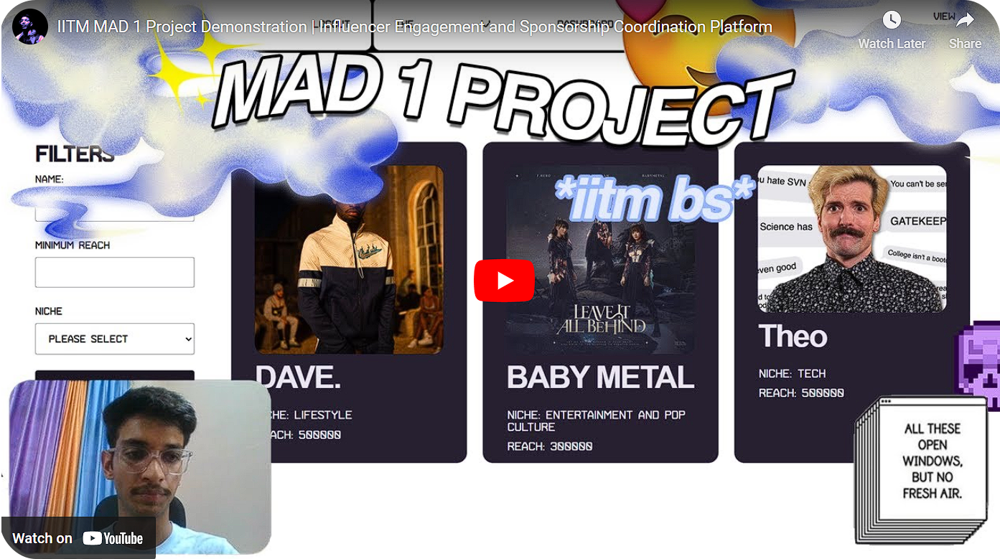

   
    Ram Ram 
   

**<h4 align="center">`Aspiring to solve real world problems and become a Technically Sound Enginner ✨`**

<pre align="center">
    💼 B.E in E.C.E @ UIET,PU • BS @ IIT Madras 
    •💻  Full stack dev • 🌎 India • 🇮🇳
    🎮 Music • Games • Code • Graphic Designing
    ➡️ When I am not glued to the screen you will 
    probably find me on the football pitch or on the dance floor.
</pre>
</h4>

  

* 🌱 I’m currently learning **Full stack development and Machine Learning**
* 🛕 Based out of **United Sectors of Chandigarh**

* 👨‍💻 All of my projects are available at [my portfolio](https://saber-farmer-a8f.notion.site/Portfolio-1e94d0b5ce434afeaade3ffa71fe5c28?pvs=4)

* 📫 Get in touch: **<k4p1ll.23@gmail.com>**

* ⚡ Fun fact **2+2 is 4 -1 that's 3, Quick Mafs !**

 

  

<h3 align="left">Connect with me:</h3>

   

---

  

 

#### Languages :  

 &nbsp;  &nbsp;  &nbsp;  &nbsp; 

#### Technologies :

 &nbsp;  &nbsp;  &nbsp;  &nbsp;  &nbsp;  &nbsp;   &nbsp;  &nbsp;  &nbsp;  &nbsp;  &nbsp;  &nbsp;  &nbsp;  &nbsp;  &nbsp;  &nbsp; 

 

 

**
 Click here for Github Stats 
**
 

 

##### If you have any questions, suggestions, or just want to say hi, feel free to reach out, I'll be happy to meet you. Peace 

 

